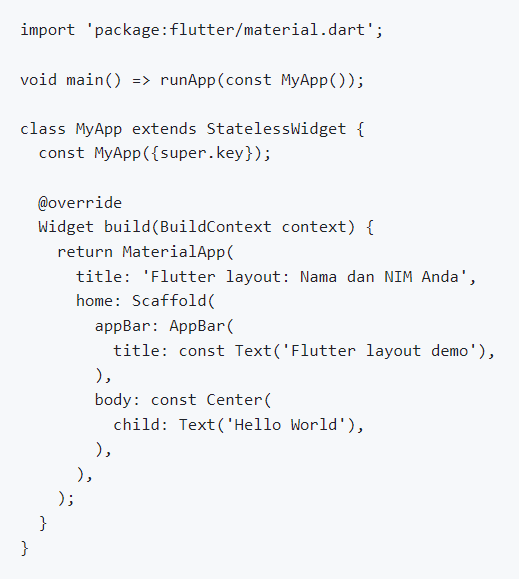
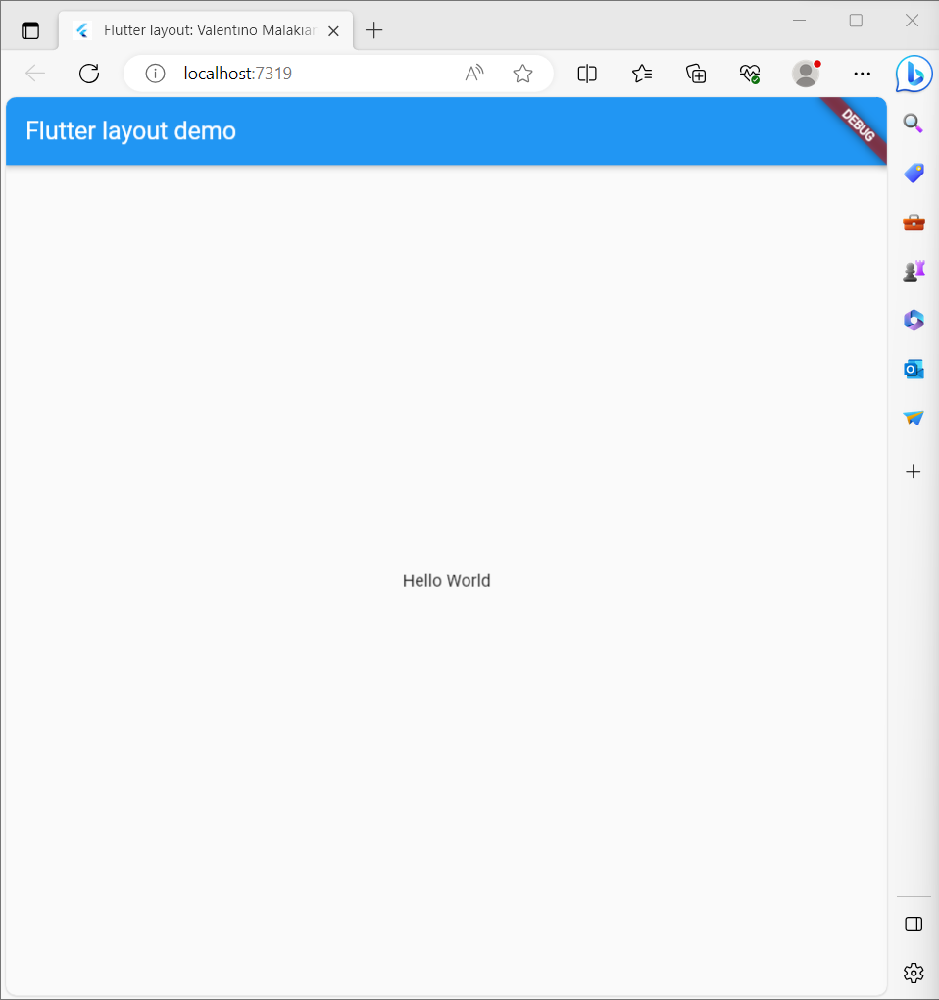
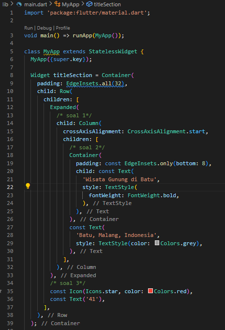
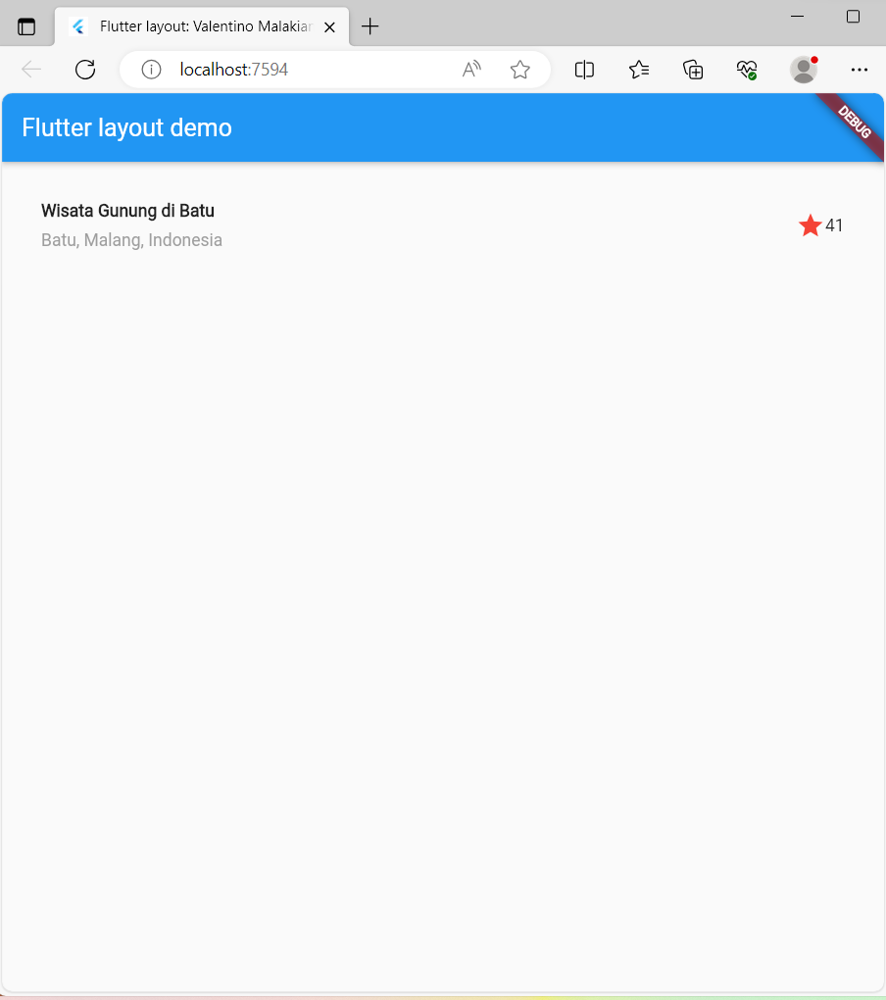
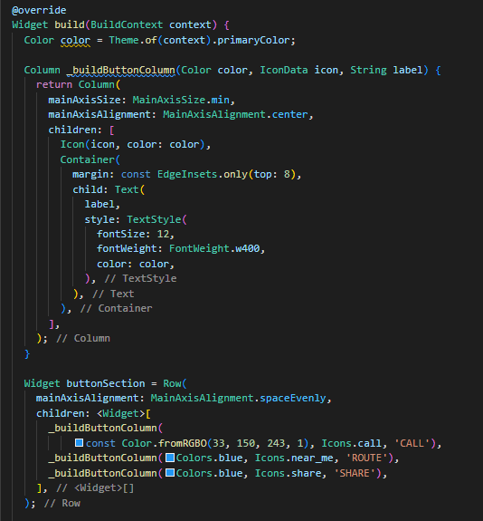
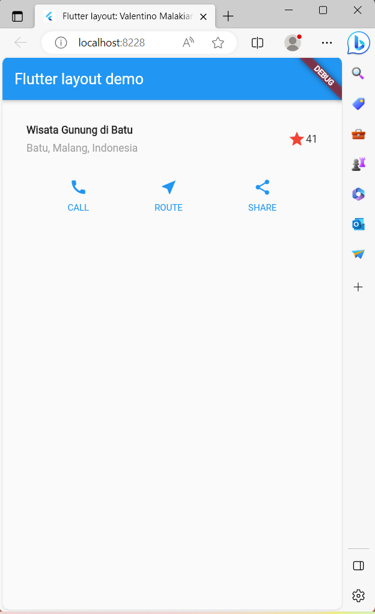
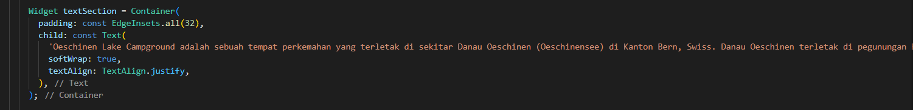
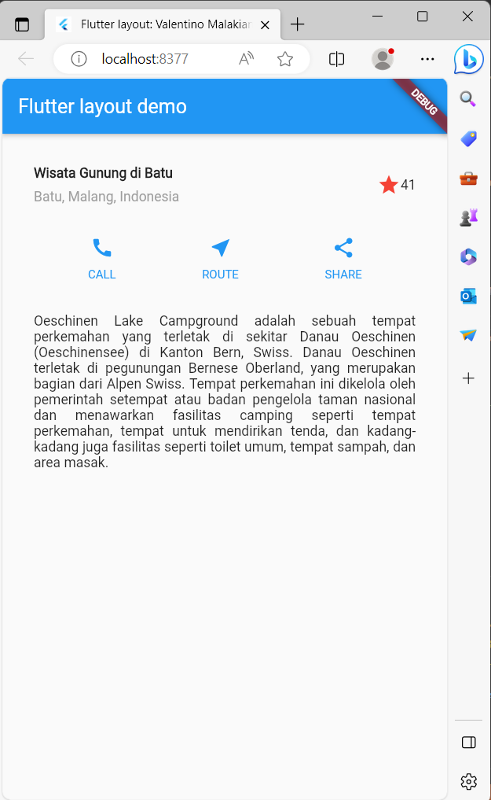
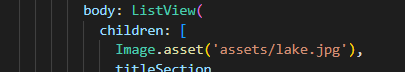

## Jobsheet 7

### Valentino Malakianno
### TI-3G
### 2141720099

### Praktikum 1 : Membangun Layout di Flutter
Kode Program : 

Output : 

### Mengidentifikasi Layout Diagram
Dalam hal ini menyusun elemen menjadi sebuah kolom: sebuah gambar, dua baris, dan satu blok teks. Selanjutnya, buat diagram setiap baris. Baris pertama, disebut bagian Judul, memiliki 3 anak: kolom teks, ikon bintang, dan angka. Anak pertamanya, kolom, berisi 2 baris teks. Kolom pertama itu memakan banyak ruang, sehingga harus dibungkus dengan widget yang diperluas. Baris kedua, disebut bagian Tombol, juga memiliki 3 anak: setiap anak merupakan kolom yang berisi ikon dan teks.

### Implementasi Tittle Row
Kode Program : 

Output : 

### Praktikum 2 : Implementasi Button Row
Kode Program :

Output : 

### Praktikum 3 : Implementasi Text Section
Kode Program : 

Output : 

### Praktikum 4 : Implementasi Image Section
Kode Program : 

Output : 

